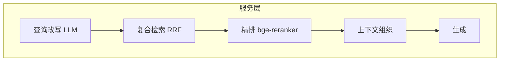

# M2 系统架构设计 + 技术选型说明

> **文档来源**：需求文档 → 架构设计（spec-kit /speckit-analyze + /speckit-specify）→ V1 架构图 → 迭代中更新 V2/V3
> **阶段**：M2（V1 初版）+ M5（V2/V3 更新）
> **日期**：2026-08-29

---

## 一、系统架构图（最终版 V3）

**V3 新增**：reranker 精排（粗排15→精排5）+ 查询改写 + 上下文组织 + 前端 Kimi 风格。

## 二、架构演进说明（为什么这么演进）

| 维度 | V1 | V2 | V3 | 为什么演进 |
|---|---|---|---|---|
| 检索 | 朴素向量 | dense+sparse RRF | +精排 | 多文档噪声大，需复合+精排 |
| 可观测 | 无 | trace 8步 | trace 增强 | 没有 trace 无法归因优化 |
| 复杂元素 | 纯文本 | 表/图/公式 | 保留 | 国标含大量表格公式图 |
| 查询 | 原样 | 原样 | LLM 改写 | 口语问题与术语不匹配 |

---

# 技术选型说明（能力 × 需求 × 成本）

| 环节 | 选型 | 为什么（能力×需求×成本） |
|---|---|---|
| 解析 | MinerU + fitz 双通道 | 需求：国标 PDF 有页码/表格/图。fitz 秒级处理正常 PDF；MinerU GPU 处理乱码/扫描。成本：本地 GPU |
| 向量化 | BGE-M3 | 需求：语义+关键词混合检索。一个模型同时出 dense(1024)+sparse；本地零成本 |
| 向量库 | Qdrant embedded | 需求：双向量存储+RRF 融合。named vectors 原生支持，嵌入式零运维；规模小无需 Milvus |
| 生成 | DeepSeek-V4-Flash | 需求：中文国标问答+带页码引用。Flash 级别便宜效果好 |
| 精排 | bge-reranker-v2-m3 | 需求：多文档检索噪声大。cross-encoder 精排 15 条秒级；本地推理 |
| 服务 | FastAPI | 需求：上传/构建/问答/后台多接口。自动 /docs 文档 |
| 前端 | 原生 HTML/JS | 需求：演示+后台。零构建，ECharts/KaTeX 本地化 |

**备选对比**：
- 向量库：Chroma（不支持原生 sparse 混合）❌ / Milvus（运维重）❌ / Qdrant ✅
- 前端：Vue/React（需构建链）❌ / 原生（零构建直接跑）✅
