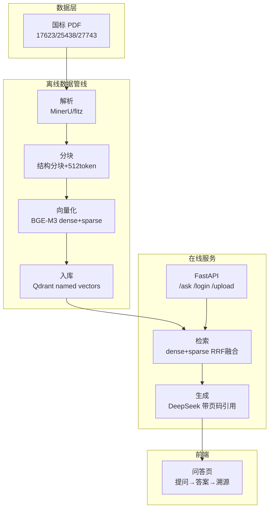
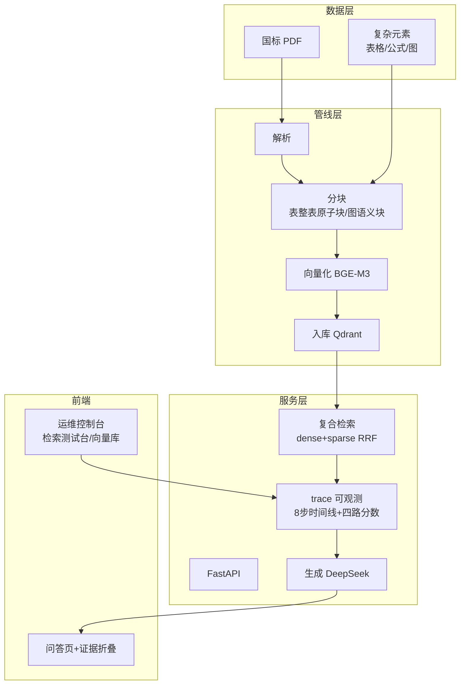
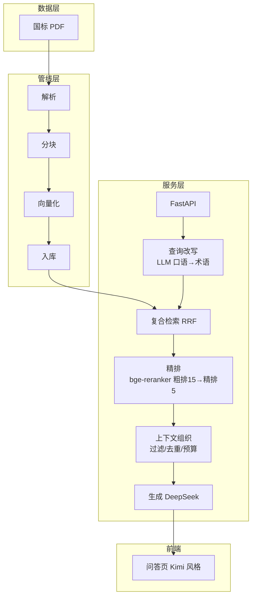

# M2 系统架构图 + 技术选型说明

## 一、V1 架构图（MVP 基线）

**V1 说明**：朴素检索（提问→答案→页码溯源）。数据管线 + 基础问答，先跑通、先建基线。

## 二、V2 架构图（增强版）

**V2 新增**：① trace 可观测（检索链路可视化，为迭代优化提供归因）② 复杂元素提取（表整表原子块/图语义块/公式）③ 复合检索（dense+sparse+RRF）④ 后台运维控制台（向量库/检索测试台）。

## 三、V3 架构图（进阶版）

**V3 新增**：① reranker 精排（粗排 15→精排 5）② 查询改写（LLM 口语→规范术语）③ 上下文组织（生成前：score 过滤/embedding 去重/token 预算）④ 前端 Kimi 风格对话式。

## 四、架构演化说明

| 维度 | V1 | V2 | V3 |
|---|---|---|---|
| 检索 | 朴素（向量相似） | dense+sparse RRF | +精排(粗排15→精排5) |
| 可观测 | 无 | trace 8步+四路分数 | trace 增强(改写/精排链路) |
| 复杂元素 | 纯文本 | 表/图/公式提取 | 保留 |
| 查询 | 原样 | 原样 | LLM 改写 |
| 前端 | 基础问答 | +证据折叠+后台 | Kimi 风格对话式 |

---

# 技术选型说明（能力 × 需求 × 成本）

| 环节 | 选型 | 为什么（能力×需求×成本） |
|---|---|---|
| 解析 | MinerU + fitz 双通道 | 需求：国标 PDF 有页码/表格/图。fitz 秒级（能力足够）处理正常 PDF；MinerU（GPU VLM）处理乱码/扫描 PDF。成本：本地 GPU，无 API 费 |
| 向量化 | BGE-M3 | 需求：语义+关键词混合检索。BGE-M3 一个模型同时出 dense(1024)+sparse，能力匹配；本地跑零成本 |
| 向量库 | Qdrant embedded | 需求：双向量存储+RRF 融合。Qdrant named vectors 原生支持，嵌入式零运维；规模小（85 块）无需 Milvus |
| 生成 | DeepSeek-V4-Flash | 需求：中文国标问答+带页码引用。DeepSeek 便宜（Flash 级别）效果好，按量付费成本低 |
| 精排 | bge-reranker-v2-m3 | 需求：多文档检索噪声大。cross-encoder 精排 15 条秒级；本地推理零成本 |
| 服务 | FastAPI | 需求：上传/构建/问答/后台多接口。FastAPI 自动 /docs 文档，开发快 |
| 前端 | 原生 HTML/JS | 需求：演示+后台管理。无框架依赖，部署简单，ECharts/KaTeX 本地化 |

**备选对比**：
- 向量库：Chroma（不支持原生 sparse 混合）❌ / Milvus（太重，运维成本高）❌ / Qdrant ✅
- 前端：Vue/React（需要构建链）❌ / 原生（零构建直接跑）✅
