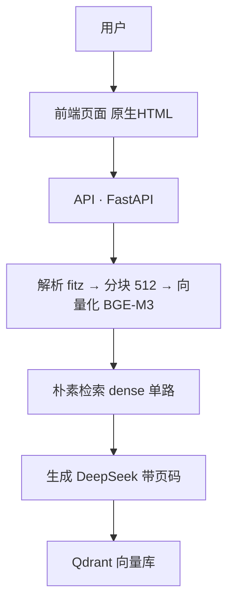
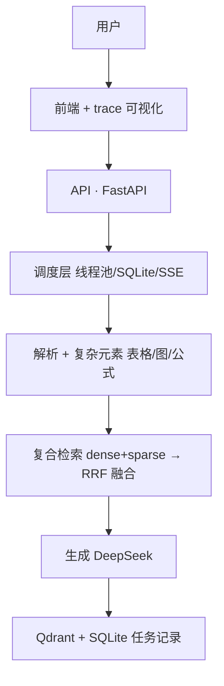
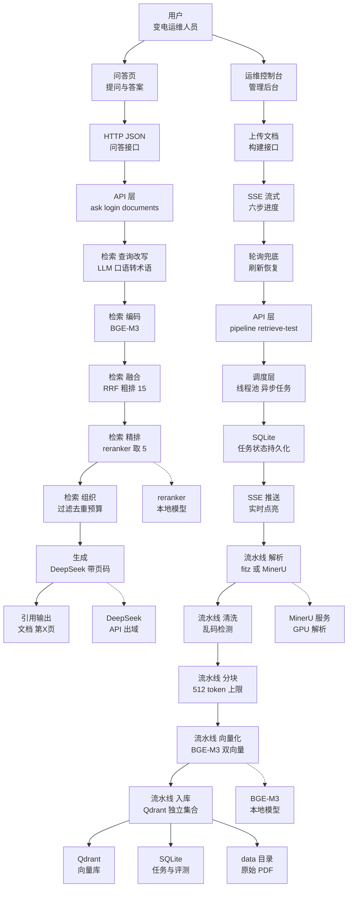

# M2 系统架构设计 + 技术选型说明

> **文档来源**：需求文档 → 架构设计（spec-kit /speckit-analyze + /speckit-specify）→ V1 架构图 → 迭代中更新 V2/V3（每版随功能演进，最终与代码一致）
> **阶段**：M2（V1 初版）+ M5（V2/V3 更新）
> **日期**：2026-08-29 初版 ｜ 2026-09-02 补全 V1/V2 架构图与分版本选型

---

## 〇、架构演进总览（V1 → V2 → V3）

> 架构图不是一次画完的，是**随版本演进的**：V1 最小闭环 → V2 加调度与复合检索 → V3 加精排与改写。每版图里的新增技术就是当时解决的问题。

| 版本 | 定位 | 一句话 | 指标 |
|---|---|---|---|
| V1 | 最小可用版 | 跑通全链路 + 立基线 | recall 0.9167 / MRR 0.6625 |
| V2 | 增强版 | 看得见（trace）+ 不丢（SQLite）+ 找得全（RRF）| 指标持平，能力升级 |
| V3 | 进阶版 | 找得准（精排 + 改写）| MRR **0.6694**（#4 救回）|

---

## 一、V1 架构图（最小可用版）



**V1 技术**（解决"能不能用"）：fitz 解析 / BGE-M3 嵌入 / Qdrant 向量库 / DeepSeek 生成 / FastAPI / 原生前端

---

## 二、V2 架构图（增强版 · 可观测 + 复合检索）



**V2 新增**（解决"看得见、不丢、找得全"）：trace 可视化 / 线程池+SQLite+SSE / RRF 融合 / 复杂元素提取

---

## 三、V3 架构图（最终版 · 进阶）



**V3 新增**（解决"找得准"）：bge-reranker 精排 / 查询改写 / 上下文组织 / 引用诚实化 / Kimi 风格前端

---

## 一·补充、总体架构（模块视图）

> 与上面的"运行时流程视图"互补：流程图回答"请求怎么流动"，本图回答"代码怎么组织"（对齐讲师总体架构风格）。

### 前端入口（5 个页面/功能）
```
首页提交 → 进程展示 → 向量库 → 检索 → 问答
（v2 待增：trace 可视化页面）
```

### REST API（传输层）
```
fetch · doc_id / query JSON    |    SSE（构建任务进度）
```

### Online Service（backend/src/sf6_rag/，FastAPI :8011）
| 模块 | 职责 |
|---|---|
| api.py | 22 个路由（ask/login/upload/pipeline/retrieve-test/admin…）|
| auth.py | 登录认证 token |
| generate.py | 回答编排 / grounded / 引用 |
| retrieve.py | 检索 / 精排 / 存取 / 查询改写(fail-open) |
| pipeline.py | 六阶段构建（解析→清洗→分块→向量化→入库→评测）|
| tasks 管理 | SQLite 持久化 + SSE 广播 |
| extract.py / chunker.py | 解析（fitz/MinerU）/ 分块 512 |
| eval_metrics.py | 评测指标（recall@k / MRR）|

### 本地模型（CPU，加载即用）
```
bge-m3（嵌入 dense+sparse）   |   bge-reranker-v2-m3（V3 精排）
```

### 外部依赖
```
DeepSeek API（查询改写 + 生成）
```

### Storage
```
Qdrant embedded（独立集合 ×3）   |   SQLite（任务/评测）   |   data/uploads（PDF）
```

### 复用产物
```
middle.json · 清洗结果   |   chunks_output.json   |   embeddings_output.json
```


---

## 二、架构演进说明（为什么这么演进）

| 维度 | V1 | V2 | V3 | 为什么演进 |
|---|---|---|---|---|
| 检索 | 朴素向量 | dense+sparse RRF | +精排 | 多文档噪声大，需复合+精排 |
| 可观测 | 无 | trace 8步 | trace 增强 | 没有 trace 无法归因优化 |
| 复杂元素 | 纯文本 | 表/图/公式 | 保留 | 国标含大量表格公式图 |
| 查询 | 原样 | 原样 | LLM 改写 | 口语问题与术语不匹配 |


## 📋 技术选型（按版本演进看——每版加了什么）

> **讲解逻辑**：技术不是一次选完的，是跟着版本长出来的。下面按版本看：V1 用基础技术、V2 加了什么、V3 又加了什么。

### 🟦 V1 用到的技术（解决"能不能用"——最小闭环的必需品）

| 架构层 | 技术 | 为什么选它 |
|---|---|---|
| 解析 | fitz | 正常 PDF 秒级解析 |
| 嵌入 | BGE-M3 | 一个模型出 dense+sparse，本地零成本 |
| 向量库 | Qdrant embedded | 双向量存储原生，免运维 |
| 生成 | DeepSeek | 中文好、便宜、支持带页码 |
| 服务 | FastAPI | 自动 /docs 文档 |
| 前端 | 原生 HTML/JS | 零构建直接跑 |

### 🟠 V2 新增的技术（解决"看得见、不丢、找得全"）

| 新增技术 | 解决什么痛点 | 用在架构哪层 |
|---|---|---|
| trace 可视化 | 答不出"为什么是它"→ 不可信 | 前端/问答链路（八步展示）|
| 线程池 + SQLite + SSE | 上传几十分钟卡页面、进度看不到、刷新就丢 | 调度层（异步不阻塞/记账不丢/推送实时）|
| RRF 融合（dense+sparse 双路）| 单路 dense 漏召回（语义相近但差一点）| 检索层（语义+关键词互补）|
| 复杂元素提取 | 表格/图片/公式纯文本会丢 | 解析/分块（MinerU GPU 兜底）|

### 🟡 V3 新增的技术（解决"找得准"——多文档去噪）

| 新增技术 | 解决什么痛点 | 用在架构哪层 |
|---|---|---|
| bge-reranker 精排 | 粗排 15 条真答案排第 7+，被漏掉 | 检索层（cross-encoder 逐条打分取 5）|
| 查询改写 | 口语问法 vs 国标术语不匹配 | 检索入口（口语→术语，带开关可回退）|
| 上下文组织 | 噪音块/重复块进 LLM 浪费预算 | 检索出口（过滤负分+去重+token 预算）|
| 引用诚实化 | 引用的块≠真正进 LLM 的块 | 生成层（citations 只列真用块）|

---

### 🔄 演进对照（同一个环节，V1→V2→V3 怎么变）

| 环节 | V1 | V2 | V3 |
|---|---|---|---|
| 检索链路 | 朴素 dense 单路 | dense+sparse **RRF 融合** | +**查询改写** → RRF → **精排取5** → **上下文组织** |
| 上传 | 同步（卡页面）| **异步**：线程池+SQLite+SSE | +轮询兜底 |
| 可观测 | 无 | **trace 八步** | trace 增强（改写在列）|
| 引用 | 拼接块 | — | **诚实化**（只列真用块）|
| 前端 | 基础页 | — | Kimi 风格浅色 |

### 💡 为什么每版加的技术不一样？（一句话）

> **V1 缺"能跑"，V2 缺"可信+不丢"，V3 缺"准"——每版只加当时最痛的一批技术，加了就评测验证（MRR 0.6625→0.6694），不一次性堆完（否则说不清谁起的作用）。**


**备选对比**：
- 向量库：Chroma（不支持原生 sparse 混合）❌ / Milvus（运维重）❌ / Qdrant ✅
- 前端：Vue/React（需构建链）❌ / 原生（零构建直接跑）✅

